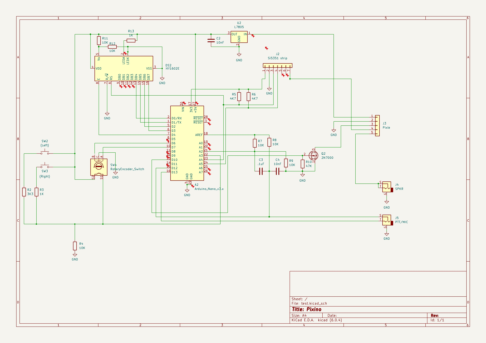

## Ham radio Pixie Transceiver controlled by an Ardunio Nano board


The Pixino board is a ham radio experimental transceiver which is 
specialized on digital modes and inspired on the algorithms
created by Summers (G0UPL) but with a more primitive implementation for
experimentation uses only, if you plan to operate seriously on digital modes
buy the excellent QRP-Labs QDX kit.

This is a project built on top of the uSDX firmware (QCX-SSB) by Guido (PE1NNZ)
with modifications from Pablo (EA2EHC), the approach to involve a Pixie kit with
a ham radio project using SDR processing has been explored previously with the
Raspberry Pi Z PixiePi project

# Intended Features

Initial project setup for HF Arduino controlled Pixie transceiver:

- Operate CW-USB
- LCD 16x2 + encoder based control
- Dual VFO (A/B) for split mode
- VOX & PTT control
- TS-480 CAT command
- Operates 7.0-7.3 MHz
- Largely inspired on Guido (PE1NNZ) with QCX-SSB.
- Largely based on my own projects Pi4D/PixiePi
- Operates with both the standard QCX-SSB and QDX algorithm

# Background

The Pixie QRPp (very low power, less than 1W output) transceiver is a very popular DIY project among hams as it is
very easy to build, test and operate from the electronic standpoint, yet able to perform some actual limited communications
(QSO) over the air.

Although really small power can be enough to sustain communications over great distances and therefore not being a per se
limiting factor there are other factors in the basic implementation which makes difficult to carry communications except
on very favorable conditions.

An explanation of how the transceiver work can be found [here](http://w1sye.org/wp-content/uploads/2017/01/NCRC_PixieOperation.pdf).

This project starts with a working Pixie transceiver (a cheap kit bought at eBay or other sellers) and to integrate it with
an Arduino Nano board controlling a Si5351 board to provide the signal generation and other functionality.

Instead of a crystal based signal generation DDS is be used. The rest of the code deals mostly with the user interface and operating features, among others:

## Hardware prototype

This is a snapshot of the current prototype used to develop and debug this project:

The original design from Guido (PE1NNZ) based on the QCX design from Hans Summers (G0UPL) at QRP-Labs


Some small modifications to adapt the controller to operate with a Pixie design



# Chinese Pixie MODS

A typical circuit for the kit might be:


Some minor modifications are needed while building the Chinese DIY Pixie kit, other versions might vary.

## Components not needed

The following components needs not to be placed when building the kit

```
* D2 - Diode 1N4001
* R6 - R 100K
* C8 - C 100nF
* W1 - R 47K (var)
* D3 - Diode 1N4148
* Y1 - Cristal 7.032 MHz
```
## Different connections (Recommended MODS)

```
* Connect Cx=100 nF on the same place than Y1 on the kit.
* Connect negative side of D3 diode to the interface board PTT line
* Cut trace from R5 to KEY socket, connect both keyer legs to the socket going into GPIO15 and GPIO13.
* Assure all three boards (interface, Pixie and Raspberry Pi) share a common ground.
* Extract +12V from the Pixie +12V socket, feed LM7805 with it, then feed the Raspberry Pi Zero board with it.
```


All additional interface circuitry might be constructed on a prototype perfboard or using the Manhattan
technique.

## Pixie Final PA heat sink

Operating with a 12V supply the final transistor might become quite hot and indeed fail if the keydown period is long enough
(as it might be with FT8 or WSPR, even for slow CW). A small heatsink is recommended.
Space is very limited on typical kits but a small piece of aluminum might be enough, be aware not to short either L1 nor L3
with it.

The keyer transistor Q1 will benefit from a heat sink as well if long keying times are expected, a cooler fan can be
turned on with the KEYER line if needed.


## Broadcast Interference (BCI)

At some locations the Chinese DIY Pixie kit might be subject to heavy BCI, in order to minimize try to replace R3 from
1K to 47-100 Ohms.

## Increase power and other features

An interesting set of low cost modifications to increase the power, improve efficiency and other enhancements to the original DIY Kit
can be found at [link](http://vtenn.com/Blog/?p=1348).

# Other alternatives

Even if the Pixie schematic is used for the project the software could be used directly with other DIY or homebrew popular
designs, among others:

* [PY2OHH's Curumim](http://py2ohh.w2c.com.br/trx/curumim/curumim.htm)
* [NorCal 49'er](http://www.norcalqrp.org/files/49er.pdf)
* [Miss Mosquita](https://www.qrpproject.de/Media/pdf/Mosquita40Engl.pdf)
* [Mosquito](http://www.qrp.cat/ea3ghs/mosquito.pdf)
* [Jersey Fireball](http://www.njqrp.club/fireball40/rev_b/fb40b_manual.pdf)

Lots of good QRPp projects can be found at [link](http://www.ncqrpp.org/) or SPRAT magazine [link](http://www.gqrp.com/sprat.htm).

# NOT really to be seen as alternative to

This project isn't a serious alternative to some excellent DIY Kits available in the market, which deliver tons of good features
at reasonable cost. This project must be seen as a learning platform enabling a very cheap DIY kit with tons of features their
intrisic limitations can not be extended to cover.
In particular this kit is NOT a replacement nor an alternative to the following superb kits that I'm aware of:

* QRP Lab's (Hans Summers) ANY product from QRP-Labs.
* CRKits (Adam Rong's) D4D kit.
* QRPGuys's DSB Digital Transceiver.
* 4S QRP Group's Cricket 40.
* ... and other similar projects ...

For all of them do yourself a favor and buy a kit, assemble it and enjoy the experience.

Not to mention other relatively higher scale setups such as the BitX, mcHF or minion SDR transceivers and, of course,
all variants of the uSDX/uSDR projects.

## DISCLAIMER

This is a pure, non-for-profit, project being performed in the pure ham radio spirit of experimentation, learning and sharing.
This project is original in conception and has a significant amount of code developed by me, it does also being built up on top
of a giant effort of others to develop the base platform and libraries used.
Therefore this code should not be used outside the limits of the license provided and in particular for uses other than
ham radio or similar experimental purposes.
No fit for any purpose is claimed nor guaranteed, use it at your own risk. The elements used are very common and safe, the skills
required very basic and limited, but again, use it at your own risk.
Despite being a software enginering professional with access to technology, infrastructure and computing facilities of different sorts
I declare this project has been performed on my own time and equipment.
This project must not be seen as a replacement for other fine kits such as the QCX, D4D, QRPGuys and similar; after all it's based on
just a USD 4.- Pixie board, so it can be compared and used with other similar boards as well as long as the Xtal can be replaced by a
DDS.

# Background

This project has been largely inspired by the work from [Guido (PE1NNZ)](http://pe1nnz.nl.eu.org) and in particular
by the [QCX-SSB](https://github.com/threeme3/QCX-SSB) project and the entire echosystem around it.

Also my own work with the projects [PixiePi](http://www.github.com/lu7did/PixiePi) and [OrangeThunder](http://www.github.com/lu7did/OrangeThunder) had
been largely used to extract code for this project.

# Work in progress

## Features

- Finalize basic operation with QCX-SSB firmware classic SSB mode.
- Incorporate QDX algorithm to generate digital modes.
- Prototype wiring for stand-alone +12V operation (internal +5V regulator).
- Add receiver functions to measure signal strength (wire SPKR to A0, polarization, enable Simple_RX, etc.)
- Customize useful functions in and non-useful functions on QCX-SSB firmware out.
- Incorporate VOX mode for transmission.
- Enable, test and deploy CAT work.
- Re-wire external keyer.
- Box.
- PCB.
- Add memory meassuring function.

## Issues

